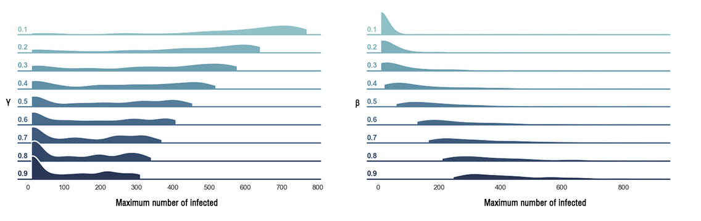

## Network-based simulations of epidemic spreading

We model social connections by a graph (network), where each node of the graph corresponds to a person and there is an edge between two nodes if the persons they represent interact with each other. Modelling social network by a graph is a well-known and widely adopted approach.

The spread of a particular disease is modeled by three quantities (compartments), very much in the spirit of the S-I-R model - a classical mathematical model in epidemiology (where S stands for susceptible, I for infected, and R for recovered; it should be noted that the Recovered class includes deaths as well).

### Simulation process 
Once the graph (cf. social connections) is fixed, to initiate the spread of disease we randomly infect a given number of nodes (e.g. 2 people import the disease, or the disease originates in a single person). Afterwards, the infection spreads according to the following dynamics:

(a) at each simulation step (corresponding to days, or other discrete time-step) each infected node infects each of its neighbors with a predefined probability beta (this shows how quickly the disease transmits from a person to person).

(b) in the same step after completing (a), each infected node becomes recovered with a given probability gamma.

(c) every recovered node cannot be infected any more in the course of the simulation.

(d) the process stops when there is no node which is infected.

### Concluding remarks 

While such models can be used to get some insights how the disease spreads in the real world,  it is important to note that the above is only an idealized mathematical model of how the infection spreads, not necessarily the rule which the actual disease follows.

We observed, based on the parameters of our model (its spread and recovery rate, and the topology of the graph, i.e. how connections between nodes are made) the number of infected follows a single peak (see the illustrations). Using such models one may test various restrictive policies on the social connections, as well as how vaccination can be used to prevent the spread.

The maximum number of infected depends on the two simulation parameters beta and gamma as shown on the plot above. Parameter beta controls how fast the disease spreads, and gamma governs the recovery rate of infected nodes. The blue distributions attribute to uncertainty in the estimation of max. N of infected due to unknown remaining model parameter. For example, on a left plot for a given value of gamma (one subplot) the parameter beta is varied. For different beta, maximum numbers of infected are obtained from simulations and drawn as a blue curve. The plots are based on simulations in a network of 1000 nodes.
